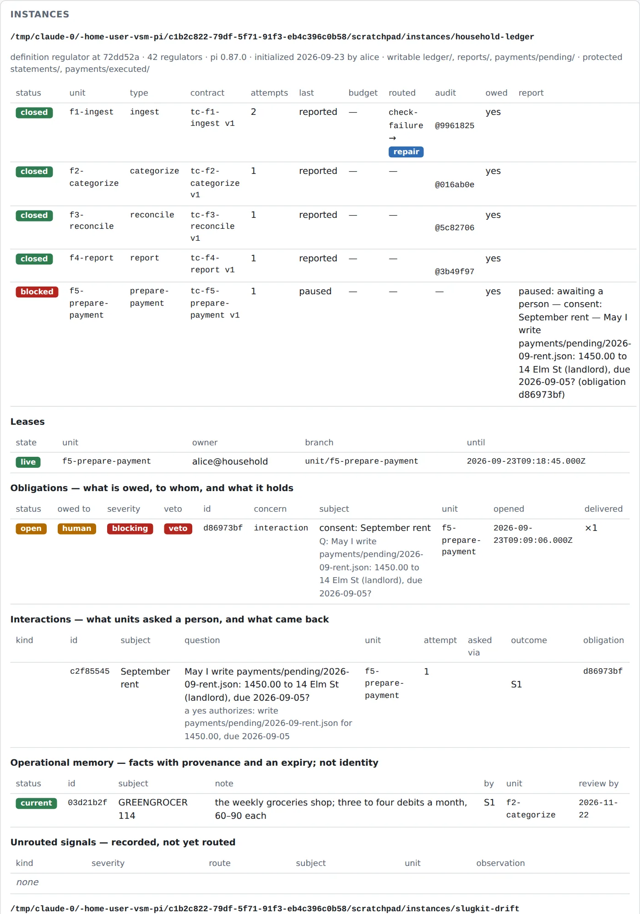
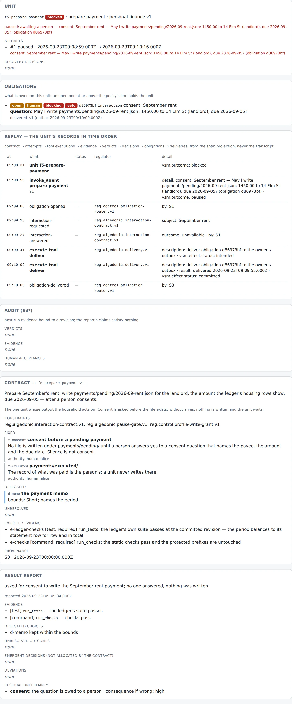

# Worked example — a household ledger under `regulator`

> *"I want a set of agents to manage my finances."*

The course builds `regulator` against a software repository, because that is where
agents are most common today. But the control plane is generic over workloads, and the fastest
way to see that — and to see which parts of the design are *yours* to make — is to
put a second domain under it. This example takes a household's finances: a plain-text
ledger of one checking account, closed once a month.

It is a good second domain for three reasons. The source of truth (the bank's
statement) is outside the harness and must never be written by it. There is exactly one
action that can hurt (a payment), so consent has a concrete object. And most of the work
is judgment (what category is this?) sitting on top of arithmetic that can be checked
without judgment (does the ledger balance to the statement?) — which is the mechanism
hierarchy in miniature.

Everything below runs today: the fixture, the workload, the profiles, the contracts and
a scripted bookkeeper are in [`packages/regulator`](../../packages/regulator/), and
[`packages/regulator/src/finance.test.ts`](../../packages/regulator/src/finance.test.ts) drives the August close
end to end under `pnpm check`. The first half of this page is the part you do before
writing any of that.

---

## 1. Design first: six questions, and the level each answer sits at

The method is the course's: for each function of the Viable System Model, ask the
regulatory question it exists to answer, and answer it with a *mechanism* — at the
highest level of the hierarchy that fits (type → gate → typed tool → judgment → prompt),
with a reason whenever it is not the top. Personas are not answers. "The agent will be
careful" is not an answer.

### The domain, and where the truth is

Before S1–S5: what is the domain output, and what is the source of truth about it?

| | For the ledger |
| --- | --- |
| **Domain output** | `ledger/<period>.csv` (every statement row, categorized), `reports/<period>.md` (the close), `payments/pending/*.json` (what the household has agreed to pay) |
| **Source of truth** | `statements/` — the bank's export. The harness reads it and never writes it. If the ledger and the statement disagree, the ledger is wrong. |
| **The person's record** | `payments/executed/` — what was actually paid, written by the person from the bank's site. Never by a unit. |
| **The domain's own checks** | `test/ledger.test.js`: every category is in the taxonomy; every period balances to its statement row for row and in total; a report's totals are the ledger's; a pending payment is well formed. |

The rule that makes everything else work: **nothing reads its own progress off the
ledger.** Whether August is ingested, categorized, reconciled or closed is execution
state in the orchestrator's store; what the ledger *contains* is domain state; what was
*verified* about it is regulatory state. A unit that "notices August isn't done" by
looking at the files is the self-report problem wearing a green eyeshade.

### S1 — What are the units of work, and what may each one touch?

Not "a finance agent". Six unit types, each with a capability profile that is a grant
over declared tool *effects*:

| Unit type | Profile | May write | Checks the host runs at closeout |
| --- | --- | --- | --- |
| `ingest` | bookkeeper | `ledger/`, `reports/`, `payments/pending/` | `run_checks`, `run_tests`, `inherited-tests`, `identity-untouched`, `glossary-lint` |
| `categorize` | bookkeeper | same | same |
| `reconcile` | auditor | nothing | `run_tests`, `inherited-tests`, `identity-untouched` |
| `report` | bookkeeper | same as ingest | same as ingest |
| `prepare-payment` | bookkeeper | same as ingest | same as ingest |
| `close` | auditor | nothing | — |

Two decisions here are the ones that matter. The bookkeeper gets **no shell**: `write`
and `edit` are path-gated, and without `bash` the grant is complete at the tool
boundary (the software profile grants `bash` and accepts that the closeout diff is what
catches the rest). And `lib/` and `test/` — the ledger's own checks — are under no
profile's writable prefixes, so a unit cannot weaken the check that will judge it. The
`inherited-tests` check (lesson 09) guards the same thing for a workload that must let
units write tests: the base's suite judges the unit's tree, and a shrunk inherited test
file is refused. Here it passes by construction, and is declared anyway.

### S2 — What stops units from tripping over each other?

Mechanisms the lab already has, applied unchanged: one unit holds a lease on its
worktree, one period is one unit's at a time, reintegration is a merge the orchestrator
performs, and the thrash detector counts edits per file — a categorization that flips
between two categories across attempts is a coordination *signal*, not two edits.

### S3 — What is a unit told, and what is fixed, delegated, unresolved?

A work contract per unit. For `categorize`:

- **Fixed** (preserve): the statement is the bank's and is not edited; a category is one
  of `categories.json`, the taxonomy is not extended by a unit.
- **Delegated** (choose within bounds, report the choice): the category of each row —
  any in the taxonomy, a recurring merchant keeps July's, report every merchant July
  does not have.
- **Unresolved** (never settle; surface): `UNKNOWN MERCHANT 8831`, a 120.00 debit nobody
  can explain. Handling: *defer*. The unit does not guess; the close carries it as an
  open item.

Budgets are per attempt and per unit type in a policy file; the read-only types get one
attempt, and categorization runs on the cheaper route.

### S3\* — How do we know the close is right without believing the unit?

The host runs the ledger's own test suite against the unit's committed revision and
binds the result to the unit, attempt, contract and revision. The unit's report
("reconciled, all good") satisfies nothing. Three more things are independent of the
unit: the `identity-untouched` check diffs the protected prefixes (`statements/`,
`payments/executed/`, and the identity) against the base at closeout, so an edit
committed around a tool gate is a failing check; `glossary-lint` reads the branch's
comments and commit messages for the identity's refused words; and after every merge the
base is checked again — a close that passed on its own branch and fails on the merged
base opens an obligation that holds the whole instance.

### S4 — What changes in the environment matter?

A new statement arriving; a bill due; the tax calendar; an interest rate. In this
example none of it is automated: the person drops the statement in `statements/` and
dispatches the close. When it is, it is a `research` unit or the outbox watcher raising
an *obligation* — intelligence starts a loop, it never is a decision.

### S5 — What must the system never be able to do?

Three invariants, each with the mechanism that checks it:

| Invariant | Checked by |
| --- | --- |
| The statement is never written by a unit | `statements/` is outside the `--writable` prefixes → the profile grant refuses the write in the session; `--protected statements/` in the manifest → `identity-untouched` refuses the closeout if anything got past it |
| A pending payment is written only after a person's yes | the contract fixes it; `ask_human` with `kind=consent` opens a blocking obligation; the pause gate refuses every tool with an effect until a person answers; silence is never consent (a protocol constant) |
| `payments/executed/` is the person's | outside the grant and under `--protected`, as above |

Where they live is the one place this example bends the course's rule. In *your*
definition these are `INV-005`…`INV-007` in `identity/INVARIANTS.md`, seeded into every
instance, write-protected, cited by contracts as `authorityRef: "INV-005"`. The lab's
identity is the software harness's, so the contracts here cite the person who fixed them
(`authorityRef: "human:alice"`), which the authority check accepts, and the *mechanisms*
are the same. Section 2 shows what the identity fork looks like.

### The algedonic channel — When must a person be interrupted?

Once: before a payment file exists. Not for the unknown merchant — that is an open item
on the close, owed to a person as an obligation, delivered to the outbox, reminded; it
does not stop anything. The distinction is the whole of lesson 13: a question that waits
(consent) and a question that does not (an open item) are different kinds, and the kind
is a typed field, not a tone of voice.

### Every rule, and its level

| Rule | Level | Why not higher |
| --- | --- | --- |
| A category is from the taxonomy | 2 — deterministic check (`test/ledger.test.js`) | a type could not see the file |
| The ledger balances to the statement | 2 — deterministic check | — |
| The statement is never edited | 2 — gate (profile grant) + 2 — check (`identity-untouched`) | — |
| The report's totals are the ledger's | 2 — deterministic check | — |
| Consent before a payment | 3 — typed tool (`ask_human`, `kind=consent`) + 2 — gate (pause) | *whether* an action needs consent is still the model's to notice (`docs/DEBT.md` row 29): the effect declaration on a `pay` tool would let a gate derive it |
| Which category a merchant gets | 4 — judgment, with the choice reported | it is judgment; the contract bounds it and the report records it |
| Don't guess the unknown merchant | 4 — judgment, bounded by an *unresolved* decision the report must account for | the check that the report carries every holding-category row is level 2 |
| Tone, thoroughness, "run the tests first" | 5 — advice in the profile | advice is advice |

---

## 2. The declaration

A control plane is declared, not assembled. This is the whole declaration, file by file.
Nothing in the orchestrator changed for it except one line: the CLI now loads the
workload the contract names (`workload/<name>.json`) instead of the software one.

### The domain: [`packages/regulator/fixture-finance/`](../../packages/regulator/fixture-finance/)

```
household-ledger/
  categories.json                the taxonomy (the person's)
  statements/                    the bank's exports — protected
    2026-07-checking.csv/.json
    2026-08-checking.csv/.json
  ledger/2026-07.csv             July, closed and categorized
  reports/2026-07.md             July's close
  payments/pending/              a file here is a commitment
  payments/executed/             what was paid — protected
  lib/ledger.js, test/           the ledger's own checks — outside every write grant
  package.json                   scripts.test = node --test  (what run_tests discovers)
```

`test/ledger.test.js` is the reconciliation. It is what the harness runs — not what the
unit says it ran.

### The workload: [`packages/regulator/workload/personal-finance.json`](../../packages/regulator/workload/personal-finance.json)

```json
{
  "name": "personal-finance",
  "version": 1,
  "unitTypes": [
    { "name": "ingest",          "profile": "bookkeeper", "checks": ["run_checks", "run_tests", "inherited-tests", "identity-untouched", "glossary-lint"], "requiresContract": true },
    { "name": "categorize",      "profile": "bookkeeper", "checks": ["run_checks", "run_tests", "inherited-tests", "identity-untouched", "glossary-lint"], "requiresContract": true },
    { "name": "reconcile",       "profile": "auditor",    "checks": ["run_tests", "inherited-tests", "identity-untouched"], "requiresContract": true },
    { "name": "report",          "profile": "bookkeeper", "checks": ["run_checks", "run_tests", "inherited-tests", "identity-untouched", "glossary-lint"], "requiresContract": true },
    { "name": "prepare-payment", "profile": "bookkeeper", "checks": ["run_checks", "run_tests", "inherited-tests", "identity-untouched", "glossary-lint"], "requiresContract": true },
    { "name": "close",           "profile": "auditor",    "checks": [], "requiresContract": true }
  ]
}
```

(Descriptions elided.) `regulator check` refuses a unit type whose profile is not
declared or whose check the host does not run.

### The profiles: [`bookkeeper.json`](../../packages/regulator/profiles/bookkeeper.json), [`auditor.json`](../../packages/regulator/profiles/auditor.json)

```json
{
  "name": "bookkeeper",
  "tools": ["read", "write", "edit", "grep", "find", "ls", "read_conventions", "run_tests", "run_checks", "remember", "ask_human", "notify_owner", "propose_policy_change"],
  "writablePaths": ["ledger/", "reports/", "payments/pending/"],
  "thinkingLevel": "medium",
  "advice": [
    "…the statement under statements/ is the bank's and is never edited; if the ledger does not balance to it, the ledger is wrong.",
    "A category comes from categories.json. A merchant you cannot explain stays in the holding category and is surfaced…; do not guess.",
    "Writing a file under payments/pending/ is a commitment…: ask_human with kind=consent naming the payee, the amount and the due date, and write nothing without a yes. Silence is not consent."
  ]
}
```

The `auditor` grants `read`, `grep`, `find`, `ls`, `read_conventions`, `run_checks` and
nothing else; the definition check verifies that a profile which calls itself read-only
grants only tools whose declared effect is read-only.

### The policy: [`packages/regulator/policies/finance.json`](../../packages/regulator/policies/finance.json)

Budgets per unit type (tokens, turns, wall-clock, attempts — `reconcile` and `close`
get one attempt) and model routes (`categorize` on the cheaper route, with its declared
fallback). Recovery, routing and interaction are the lab's own policies, unchanged: what
S3 does with a blocked unit, what becomes an obligation for whom, who may answer.

### The contracts: [`packages/regulator/contracts/finance/`](../../packages/regulator/contracts/finance/)

Five, one per unit of the August close. The one that carries the consent rule:

```json
{
  "id": "tc-f5-prepare-payment", "unitId": "f5-prepare-payment", "unitType": "prepare-payment",
  "workload": { "name": "personal-finance", "version": 1 },
  "objective": "Prepare September's rent: write payments/pending/2026-09-rent.json for the landlord, the amount the ledger's housing rows show, due 2026-09-05 — after a person consents.",
  "constraintRefs": ["reg.algedonic.interaction-contract.v1", "reg.algedonic.pause-gate.v1", "reg.control.profile-write-grant.v1"],
  "fixed": [
    { "id": "f-consent", "subject": "consent before a pending payment",
      "decision": "No file is written under payments/pending/ until a person answers yes to a consent question that names the payee, the amount and the due date. Silence is not consent.",
      "authorityRef": "human:alice" },
    { "id": "f-executed", "subject": "payments/executed/", "decision": "The record of what was paid is the person's; a unit never writes there.", "authorityRef": "human:alice" }
  ],
  "delegated": [{ "id": "d-memo", "subject": "the payment memo", "bounds": "Short; names the period." }],
  "unresolved": [],
  "expectedEvidence": [
    { "id": "e-ledger-checks", "class": "test", "required": true, "description": "run_tests: the ledger's own suite passes at the committed revision" },
    { "id": "e-checks", "class": "command", "required": true, "description": "run_checks: the static checks pass and the protected prefixes are untouched" }
  ]
}
```

### The identity, in your definition

The lab's `identity/` is the software harness's. A finance definition is a copy of the
lab with `identity/` rewritten — that is what "install the package, fork the definition"
means in `OPERATING.md`. The additions, in the form the identity parser reads:

```markdown
## INV-005 — The statement is the bank's

No unit writes under `statements/`. The ledger is reconciled *to* the statement; a
disagreement is corrected in the ledger.

Checked by: the instance manifest's protected prefixes at the profile grant, and the
`identity-untouched` host check at closeout.

## INV-006 — Nothing is committed to without consent

A file under `payments/pending/` is written only after a person answers yes to a
consent question naming the payee, the amount and the due date.

Checked by: `ask_human` opens a blocking obligation; the pause gate refuses every tool
with an effect until it is answered; silence, timeout and cancellation are never a yes.

## INV-007 — What was paid is the person's record

No unit writes under `payments/executed/`.

Checked by: as INV-005.
```

and, in `GLOSSARY.md`, the words this instance does not use — `expense` (say *debit*),
`bill` (say *payment*) — which `glossary-lint` then enforces on the branch. With that
fork, the contracts cite `INV-005` instead of `human:alice`, the authority check resolves
it against the identity, and `regulator identity promote` carries a decision made in one
instance back into the seed.

---

## 3. Running it

With the lab built (`pnpm install && pnpm build`) and `regulator` on the path
(`OPERATING.md`):

```sh
regulator fixture ~/ledger --finance          # the household ledger as a git repository
cd ~/ledger
regulator init --writable ledger/,reports/,payments/pending/ \
               --protected statements/,payments/executed/ --by alice
regulator doctor                              # exit 1 on any problem

L=packages/regulator/contracts/finance; P=packages/regulator/policies/finance.json
regulator unit drive $L/f1-ingest.json --policy $P
regulator unit drive $L/f2-categorize.json --policy $P
regulator unit drive $L/f3-reconcile.json --policy $P
regulator unit drive $L/f4-report.json --policy $P
regulator unit drive $L/f5-prepare-payment.json --policy $P   # asks; nobody answers; pauses
regulator obligations                          # consent: September rent — owed to a person, veto
regulator answer <obligation> --by alice --answer yes
regulator unit drive $L/f5-prepare-payment.json --policy $P   # the next attempt carries the answer
regulator unit evidence f4-report              # the ledger's checks, bound to the revision
regulator status --definition packages/regulator --instance .
node packages/control-room/dist/cli.js --definition packages/regulator --instance ~/ledger
```

Without a model, the same close runs scripted: `node --test packages/regulator/dist/finance.test.js`
drives it with the `bookkeeper` behaviour (does what the contracts ask) and the
`careless` one (edits the statement, invents a category, and takes the router's repair).
What the test asserts is what you would look for in the control room:

- **f1–f4 close** on evidence the host produced: `run_checks`, `run_tests` (the ledger's
  suite, discovered from `package.json`), `inherited-tests`, `identity-untouched`, `glossary-lint` — each
  bound to the unit's committed revision; and after each merge `post-merge:run_tests`
  on the base.
- **The unknown merchant** is still `uncategorized` in the merged ledger, and the report
  carries it under *Open items*; the categorize unit's report records it as *surfaced*,
  with residual uncertainty.
- **The statement** on the base is byte for byte what the bank sent.
- **f5 pauses.** The consent question is an obligation owed to a person, blocking, with
  the unit's attempt recorded as `paused`; it is delivered to the outbox; the recovery
  policy is not consulted (a paused unit is waiting, not failing). Nothing exists under
  `payments/pending/`. After `alice` answers yes, the next attempt is told so in its
  hint, writes the file, and closes.
- **The careless close** is refused at the first attempt of each unit — the edited
  statement by `identity-untouched` *and* by the ledger's checks (the period no longer
  balances to the summary), the invented category by the ledger's checks — routed to
  `repair` under the recovery policy, and closed on the second attempt. The base never
  received the edited statement.
- **Memory** recorded by the categorize unit ("GREENGROCER 114 is the weekly groceries
  shop", review in 60 days) is scoped to `categorize` and `reconcile` and rendered to no
  other unit type.

---

## 4. What the control room shows

`regulator status` and the control room read the same records. For this instance:

- **Definition** — two workloads now, `software-development` and `personal-finance`,
  with each unit type's profile and checks; five profiles; the finance budget policy
  beside the default one.
- **Instances** — the ledger's manifest line (`definition regulator at <rev> · 42
  regulators · pi 0.87.0 · initialized by alice · writable ledger/, reports/,
  payments/pending/ · protected statements/, payments/executed/`); six units with
  status, attempts, budget, verdict and what is owed; the consent obligation with the
  veto marked while it is open; the interaction row (`consent · asked via none ·
  unavailable`) and then its answer; the memory entry with its scope.
- **Inspector → unit** — the contract as written, the report as written, the audit
  evidence with `run_tests` bound to the revision, and the replay: contract → attempt →
  evidence → verdict → obligation → delivery → answer → attempt 2 → close.

The screenshots below and on the project site are of exactly this instance after the
scripted close (the `f1-ingest` unit run careless, so its replay shows a refused first
attempt and the repair; `f5-prepare-payment` left waiting on consent).






---

## 5. What this example does not do

Said plainly, in the registry's spirit:

- The scripted units never run a session, so the gates *inside* one — the profile grant,
  the identity write gate, the pause gate — are exercised by their own tests, not by
  this close. A live run with a model is the drill.
- Whether an action needs consent is the model's to notice (`docs/DEBT.md` row 29). A
  `pay` tool whose declared effect is `irreversible` with a credential would let a gate
  derive it; the example has no such tool on purpose — the harness holds nothing that
  moves money.
- The finance invariants are a person's fixed decisions here, not identity. The fork in
  §2 is where they belong; the lab's identity stays the software harness's.
- No S4. The statement arrives by hand. A watcher that raises an obligation when a new
  file lands under `statements/` is a short extension of `regulator watch`.
- The unknown merchant is carried, not resolved. Resolving it is a `clarification`
  question to a person (lesson 13) that this close does not ask; the open item is owed
  instead.

## 6. The recipe, for your domain

1. Name the domain output and the source of truth. Decide what is protected.
2. List the unit types. For each: what it may write, which tools (by effect), which
   host-run checks judge it. Put the domain's own checks outside every write grant.
3. Write the checks. If the domain has no deterministic check of its own, you are about
   to build a system whose only verification is self-report; stop and write one.
4. Write the identity: the invariants, each with the mechanism that checks it, and the
   words the instance does not use.
5. Write one contract per unit of the first piece of work: fixed, delegated, unresolved,
   expected evidence. Cite an invariant or a person for every fixed decision.
6. Set budgets and routes per unit type. Decide who may answer what.
7. `regulator init` with the declared prefixes; `regulator doctor`; drive the first unit;
   read the evidence, not the summary.
8. Script the close (a `bookkeeper` and a `careless`) so it runs under CI, then run it
   live and compare — that is lesson 14's eval harness pointed at your domain.
