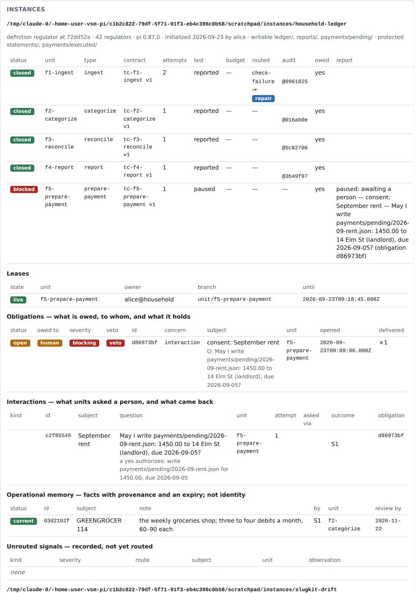
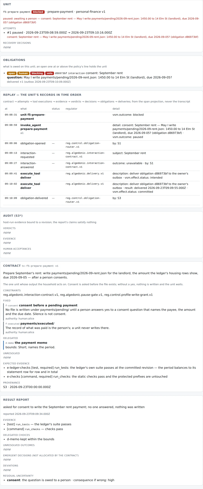

# Worked example — a household ledger under `regulator`

> *"I want a set of agents to manage my finances."*

The course builds `regulator` against a software repository, because that is where
agents are most common today. The control plane itself is generic over workloads, though,
and the fastest way to see that, and to see which parts of the design are *yours* to
make, is to put a second domain under it. This example takes a household's finances: a
plain-text ledger of one checking account, closed once a month.

It is a good second domain for three reasons. The source of truth, the bank's statement,
sits outside the harness and must never be written by it. There is exactly one action
that can hurt, a payment, so consent has a concrete object. And most of the work is
judgment (what category is this?) sitting on top of arithmetic that can be checked
without any judgment at all (does the ledger balance to the statement?), which is the
mechanism hierarchy in miniature.

Everything below runs today. The fixture, the workload, the profiles, the contracts and
a scripted bookkeeper are in [`packages/regulator`](../../packages/regulator/), and
[`packages/regulator/src/finance.test.ts`](../../packages/regulator/src/finance.test.ts) drives the August close
end to end under `pnpm check`. The first half of this page is the part you do before
writing any of that.

---

## 1. Design first: six questions, and the level each answer sits at

The method is the course's. For each function of the Viable System Model, ask the
regulatory question it exists to answer, then answer it with a *mechanism* at the
highest level of the hierarchy that fits (type → gate → typed tool → judgment →
prompt), and give a reason whenever the answer sits below the top. A persona does not
count as an answer, and neither does "the agent will be careful", because nothing can
check either one.

### The domain, and where the truth is

Before S1 to S5 come two prior questions: what is the domain output, and what is the
source of truth about it?

| | For the ledger |
| --- | --- |
| Domain output | Three kinds of file. `ledger/<period>.csv` holds every statement row, categorized; `reports/<period>.md` is the close; `payments/pending/*.json` is what the household has agreed to pay. |
| Source of truth | `statements/`, the bank's export. The harness reads it and never writes it. If the ledger and the statement disagree, the ledger is wrong. |
| The person's record | `payments/executed/`, the record of what was actually paid. The person writes it from the bank's site; a unit never does. |
| The domain's own checks | `test/ledger.test.js` checks four things: every category is in the taxonomy, every period balances to its statement row for row and in total, a report's totals are the ledger's, and a pending payment is well formed. |

One rule makes everything else work: **nothing reads its own progress off the ledger.**
Whether August is ingested, categorized, reconciled or closed is execution state, and it
lives in the orchestrator's store. What the ledger *contains* is domain state. What was
*verified* about it is regulatory state. A unit that "notices August isn't done" by
looking at the files is the self-report problem wearing a green eyeshade.

### S1 — What are the units of work, and what may each one touch?

The request at the top of the page asks for "agents". The answer is six unit types, each
under a capability profile. A profile is a grant over declared tool *effects*, so the
"may write" column below is what the profile permits, and the last column is what the
host runs against the unit's committed revision at closeout:

| Unit type | Profile | May write | Checks the host runs at closeout |
| --- | --- | --- | --- |
| `ingest` | bookkeeper | `ledger/`, `reports/`, `payments/pending/` | `run_checks`, `run_tests`, `inherited-tests`, `identity-untouched`, `glossary-lint` |
| `categorize` | bookkeeper | same as ingest | same as ingest |
| `reconcile` | auditor | nothing | `run_tests`, `inherited-tests`, `identity-untouched` |
| `report` | bookkeeper | same as ingest | same as ingest |
| `prepare-payment` | bookkeeper | same as ingest | same as ingest |
| `close` | auditor | nothing | — |

Two decisions in this table matter more than the rest. The first is that the bookkeeper
gets no shell. `write` and `edit` are path-gated, and without `bash` there is no other
route to the files, so the grant is complete at the tool boundary. (The software profile
grants `bash` and accepts that the closeout diff is what catches the rest.) The second is
that `lib/` and `test/`, the ledger's own checks, are under no profile's writable
prefixes, so a unit cannot weaken the check that will judge it. The `inherited-tests`
check guards the same thing for a workload that must let units write tests: the base's
suite judges the unit's tree, and a shrunk inherited test file is refused. Here it passes
by construction, since no unit can write under `test/` at all, and it is declared
anyway.

### S2 — What stops units from tripping over each other?

The mechanisms the lab already has apply here unchanged. One unit holds a lease on its
worktree, and one period belongs to one unit at a time. Reintegration is a merge the
orchestrator performs. The thrash detector counts edits per file, which is how a
categorization that flips between two categories across attempts becomes a coordination
*signal* instead of passing as two unrelated edits.

### S3 — What is a unit told, and what is fixed, delegated, unresolved?

Each unit gets a work contract. The one for `categorize` sorts its decisions into three
kinds:

- Fixed decisions, which the unit preserves: the statement is the bank's and is not
  edited, and a category is one of `categories.json`; the taxonomy is not extended by a
  unit.
- Delegated decisions, which the unit chooses within bounds and reports: the category of
  each row. Any category in the taxonomy is allowed, a recurring merchant keeps July's,
  and every merchant July does not have is reported.
- Unresolved decisions, which the unit never settles and instead surfaces:
  `UNKNOWN MERCHANT 8831`, a 120.00 debit nobody can explain. Its handling is *defer*.
  The unit does not guess, and the close carries it as an open item.

Budgets are set per attempt and per unit type in a policy file. The read-only types get
one attempt, and categorization runs on the cheaper route.

### S3\* — How do we know the close is right without believing the unit?

The host runs the ledger's own test suite against the unit's committed revision and
binds the result to the unit, the attempt, the contract and the revision. The unit's own
report ("reconciled, all good") satisfies nothing, because the question is what the
suite found, and the suite ran outside the unit. Three more checks are independent of
the unit in the same way. The `identity-untouched` check diffs the protected prefixes
(`statements/`, `payments/executed/`, and the identity) against the base at closeout, so
an edit committed around a tool gate still fails a check. `glossary-lint` reads the
branch's comments and commit messages for the identity's refused words. And after every
merge the base is checked again, so a close that passed on its own branch and fails on
the merged base opens an obligation that holds the whole instance.

### S4 — What changes in the environment matter?

The environment changes when a new statement arrives, when a bill comes due, when the
tax calendar turns or when an interest rate moves. In this example none of that is
automated: the person drops the statement in `statements/` and dispatches the close.
When it is automated, the mechanism is a `research` unit or the outbox watcher raising
an *obligation*. Intelligence starts a loop; it is never itself a decision.

### S5 — What must the system never be able to do?

There are three invariants, and each comes with the mechanism that checks it:

| Invariant | Checked by |
| --- | --- |
| The statement is never written by a unit | `statements/` is outside the `--writable` prefixes, so the profile grant refuses the write in the session. `--protected statements/` in the manifest means `identity-untouched` refuses the closeout if anything got past the grant. |
| A pending payment is written only after a person's yes | The contract fixes it. `ask_human` with `kind=consent` opens a blocking obligation, and the pause gate refuses every tool with an effect until a person answers. Silence is never consent; that rule is a protocol constant. |
| `payments/executed/` is the person's | The prefix is outside the grant and under `--protected`, as for the statement. |

Where the invariants live is the one place this example bends the course's rule. In
*your* definition they are `INV-005` to `INV-007` in `identity/INVARIANTS.md`, seeded
into every instance, write-protected, and cited by contracts as
`authorityRef: "INV-005"`. The lab's identity is the software harness's, though, so the
contracts here cite the person who fixed them instead (`authorityRef: "human:alice"`).
The authority check accepts a person as well as an invariant, and the *mechanisms* that
enforce the decision are the same either way. Section 2 shows what the identity fork
looks like.

### The algedonic channel — When must a person be interrupted?

A person is interrupted once, before a payment file exists. The unknown merchant does
not interrupt anyone. It is an open item on the close, owed to a person as an
obligation, delivered to the outbox and reminded about, and it stops nothing while it
waits. That distinction is the whole of the algedonic path. A question that waits for
its answer (consent) and a question that does not (an open item) are different kinds of
question, and the kind is a typed field on the question, so it is never read from the
tone of a prompt.

### Every rule, and its level

| Rule | Level | Why not higher |
| --- | --- | --- |
| A category is from the taxonomy | 2, a deterministic check (`test/ledger.test.js`) | a type could not see the file |
| The ledger balances to the statement | 2, a deterministic check | — |
| The statement is never edited | 2, a gate (the profile grant), plus 2, a check (`identity-untouched`) | — |
| The report's totals are the ledger's | 2, a deterministic check | — |
| Consent before a payment | 3, a typed tool (`ask_human`, `kind=consent`), plus 2, a gate (pause) | *whether* an action needs consent is still the model's to notice (`docs/DEBT.md` row 29). An effect declaration on a `pay` tool would let a gate derive it instead. |
| Which category a merchant gets | 4, judgment, with the choice reported | it is judgment. The contract bounds it and the report records it. |
| Don't guess the unknown merchant | 4, judgment, bounded by an *unresolved* decision the report must account for | the check that the report carries every holding-category row is level 2 |
| Tone, thoroughness, "run the tests first" | 5, advice in the profile | it is advice, which is the bottom of the hierarchy by definition |

---

## 2. The declaration

A control plane is declared, and the declaration is a set of files. What follows is the
whole of it for the ledger, file by file. Nothing in the orchestrator changed for it
except one line: the CLI now loads the workload the contract names
(`workload/<name>.json`) where it used to load the software one.

### The domain: [`packages/regulator/fixture-finance/`](../../packages/regulator/fixture-finance/)

```
household-ledger/
  categories.json                the taxonomy (the person's)
  statements/                    the bank's exports — protected
    2026-07-checking.csv/.json
    2026-08-checking.csv/.json
  ledger/2026-07.csv             July, closed and categorized
  reports/2026-07.md             July's close
  payments/pending/              a file here is a commitment
  payments/executed/             what was paid — protected
  lib/ledger.js, test/           the ledger's own checks — outside every write grant
  package.json                   scripts.test = node --test  (what run_tests discovers)
```

`test/ledger.test.js` is the reconciliation, and it is what the harness runs. What the
unit says it ran carries no weight against that result.

### The workload: [`packages/regulator/workload/personal-finance.json`](../../packages/regulator/workload/personal-finance.json)

```json
{
  "name": "personal-finance",
  "version": 1,
  "unitTypes": [
    { "name": "ingest",          "profile": "bookkeeper", "checks": ["run_checks", "run_tests", "inherited-tests", "identity-untouched", "glossary-lint"], "requiresContract": true },
    { "name": "categorize",      "profile": "bookkeeper", "checks": ["run_checks", "run_tests", "inherited-tests", "identity-untouched", "glossary-lint"], "requiresContract": true },
    { "name": "reconcile",       "profile": "auditor",    "checks": ["run_tests", "inherited-tests", "identity-untouched"], "requiresContract": true },
    { "name": "report",          "profile": "bookkeeper", "checks": ["run_checks", "run_tests", "inherited-tests", "identity-untouched", "glossary-lint"], "requiresContract": true },
    { "name": "prepare-payment", "profile": "bookkeeper", "checks": ["run_checks", "run_tests", "inherited-tests", "identity-untouched", "glossary-lint"], "requiresContract": true },
    { "name": "close",           "profile": "auditor",    "checks": [], "requiresContract": true }
  ]
}
```

The descriptions are elided. `regulator check` refuses a unit type whose profile is not
declared or whose check the host does not run.

### The profiles: [`bookkeeper.json`](../../packages/regulator/profiles/bookkeeper.json), [`auditor.json`](../../packages/regulator/profiles/auditor.json)

```json
{
  "name": "bookkeeper",
  "tools": ["read", "write", "edit", "grep", "find", "ls", "read_conventions", "run_tests", "run_checks", "remember", "ask_human", "notify_owner", "propose_policy_change"],
  "writablePaths": ["ledger/", "reports/", "payments/pending/"],
  "thinkingLevel": "medium",
  "advice": [
    "…the statement under statements/ is the bank's and is never edited; if the ledger does not balance to it, the ledger is wrong.",
    "A category comes from categories.json. A merchant you cannot explain stays in the holding category and is surfaced…; do not guess.",
    "Writing a file under payments/pending/ is a commitment…: ask_human with kind=consent naming the payee, the amount and the due date, and write nothing without a yes. Silence is not consent."
  ]
}
```

The `auditor` grants `read`, `grep`, `find`, `ls`, `read_conventions`, `run_checks` and
nothing else. The definition check verifies that a profile which calls itself read-only
grants only tools whose declared effect is read-only, so the profile's claim is checked
against the tools' effect declarations.

### The policy: [`packages/regulator/policies/finance.json`](../../packages/regulator/policies/finance.json)

The policy sets budgets per unit type (tokens, turns, wall-clock and attempts;
`reconcile` and `close` get one attempt) and model routes (`categorize` runs on the
cheaper route, with its declared fallback). Recovery, routing and interaction are the
lab's own policies, unchanged. They decide what S3 does with a blocked unit, what becomes
an obligation and for whom, and who may answer.

### The contracts: [`packages/regulator/contracts/finance/`](../../packages/regulator/contracts/finance/)

There are five, one per unit of the August close. This is the one that carries the
consent rule:

```json
{
  "id": "tc-f5-prepare-payment", "unitId": "f5-prepare-payment", "unitType": "prepare-payment",
  "workload": { "name": "personal-finance", "version": 1 },
  "objective": "Prepare September's rent: write payments/pending/2026-09-rent.json for the landlord, the amount the ledger's housing rows show, due 2026-09-05 — after a person consents.",
  "constraintRefs": ["reg.algedonic.interaction-contract.v1", "reg.algedonic.pause-gate.v1", "reg.control.profile-write-grant.v1"],
  "fixed": [
    { "id": "f-consent", "subject": "consent before a pending payment",
      "decision": "No file is written under payments/pending/ until a person answers yes to a consent question that names the payee, the amount and the due date. Silence is not consent.",
      "authorityRef": "human:alice" },
    { "id": "f-executed", "subject": "payments/executed/", "decision": "The record of what was paid is the person's; a unit never writes there.", "authorityRef": "human:alice" }
  ],
  "delegated": [{ "id": "d-memo", "subject": "the payment memo", "bounds": "Short; names the period." }],
  "unresolved": [],
  "expectedEvidence": [
    { "id": "e-ledger-checks", "class": "test", "required": true, "description": "run_tests: the ledger's own suite passes at the committed revision" },
    { "id": "e-checks", "class": "command", "required": true, "description": "run_checks: the static checks pass and the protected prefixes are untouched" }
  ]
}
```

### The identity, in your definition

The lab's `identity/` is the software harness's. A finance definition is a copy of the
lab with `identity/` rewritten, which is what "install the package, fork the definition"
means in `OPERATING.md`. These are the additions, in the form the identity parser reads:

```markdown
## INV-005 — The statement is the bank's

No unit writes under `statements/`. The ledger is reconciled *to* the statement; a
disagreement is corrected in the ledger.

Checked by: the instance manifest's protected prefixes at the profile grant, and the
`identity-untouched` host check at closeout.

## INV-006 — Nothing is committed to without consent

A file under `payments/pending/` is written only after a person answers yes to a
consent question naming the payee, the amount and the due date.

Checked by: `ask_human` opens a blocking obligation; the pause gate refuses every tool
with an effect until it is answered; silence, timeout and cancellation are never a yes.

## INV-007 — What was paid is the person's record

No unit writes under `payments/executed/`.

Checked by: as INV-005.
```

The fork also adds, in `GLOSSARY.md`, the words this instance does not use: `expense`
(say *debit*) and `bill` (say *payment*). `glossary-lint` then enforces them on the
branch. With that fork in place, the contracts cite `INV-005` where they cite
`human:alice` today, the authority check resolves the reference against the identity,
and `regulator identity promote` carries a decision made in one instance back into the
seed.

---

## 3. Running it

With the lab built (`pnpm install && pnpm build`) and `regulator` on the path, as
`OPERATING.md` describes, the close runs like this:

```sh
regulator fixture ~/ledger --finance          # the household ledger as a git repository
cd ~/ledger
regulator init --writable ledger/,reports/,payments/pending/ \
               --protected statements/,payments/executed/ --by alice
regulator doctor                              # exit 1 on any problem

L=packages/regulator/contracts/finance; P=packages/regulator/policies/finance.json
regulator unit drive $L/f1-ingest.json --policy $P
regulator unit drive $L/f2-categorize.json --policy $P
regulator unit drive $L/f3-reconcile.json --policy $P
regulator unit drive $L/f4-report.json --policy $P
regulator unit drive $L/f5-prepare-payment.json --policy $P   # asks; nobody answers; pauses
regulator obligations                          # consent: September rent — owed to a person, veto
regulator answer <obligation> --by alice --answer yes
regulator unit drive $L/f5-prepare-payment.json --policy $P   # the next attempt carries the answer
regulator unit evidence f4-report              # the ledger's checks, bound to the revision
regulator status --definition packages/regulator --instance .
node packages/control-room/dist/cli.js --definition packages/regulator --instance ~/ledger
```

Without a model, the same close runs scripted. `node --test packages/regulator/dist/finance.test.js`
drives it with two behaviours: the `bookkeeper`, which does what the contracts ask, and
the `careless`, which edits the statement, invents a category, and takes the router's
repair. What the test asserts is what you would look for in the control room:

- Units f1 to f4 close on evidence the host produced: `run_checks`, `run_tests` (the
  ledger's suite, discovered from `package.json`), `inherited-tests`, `identity-untouched`
  and `glossary-lint`, each bound to the unit's committed revision, and, before each
  merge lands, `pre-merge:run_tests` on the merged tree.
- The unknown merchant is still `uncategorized` in the merged ledger, and the report
  carries it under *Open items*. The categorize unit's report records it as *surfaced*,
  with residual uncertainty.
- The statement on the base is byte for byte what the bank sent.
- Unit f5 pauses. The consent question is a blocking obligation owed to a person, and
  the unit's attempt is recorded as `paused`. The question is delivered to the outbox.
  The recovery policy is not consulted, because a paused unit is waiting for an answer
  and has not failed. Nothing exists under `payments/pending/`. After `alice` answers
  yes, the next attempt is told so in its hint, writes the file, and closes.
- The careless close is refused at the first attempt of each unit. The edited statement
  is caught by `identity-untouched` *and* by the ledger's checks, since the period no
  longer balances to the summary; the invented category is caught by the ledger's
  checks. Each refused unit is routed to `repair` under the recovery policy and closes
  on the second attempt. The base never received the edited statement.
- The memory recorded by the categorize unit ("GREENGROCER 114 is the weekly groceries
  shop", review in 60 days) is scoped to `categorize` and `reconcile` and is rendered to
  no other unit type.

---

## 4. What the control room shows

`regulator status` and the control room read the same records. For this instance they
show the following.

- The definition view has two workloads now, `software-development` and
  `personal-finance`, with each unit type's profile and checks; five profiles; and the
  finance budget policy beside the default one.
- The instances view has the ledger's manifest line (`definition regulator at <rev> · 43
  regulators · pi 0.87.0 · initialized by alice · writable ledger/, reports/,
  payments/pending/ · protected statements/, payments/executed/`), then six units with
  their status, attempts, budget, verdict and what is owed, the consent obligation with
  the veto marked while it is open, the interaction row (`consent · asked via none ·
  unavailable`) followed by its answer, and the memory entry with its scope.
- The inspector, opened on a unit, has the contract as written, the report as written,
  the audit evidence with `run_tests` bound to the revision, and the replay: contract →
  attempt → evidence → verdict → obligation → delivery → answer → attempt 2 → close.

The screenshots below and on the project site are of exactly this instance after the
scripted close. The `f1-ingest` unit was run careless, so its replay shows a refused
first attempt and the repair, and `f5-prepare-payment` was left waiting on consent.






---

## 5. What this example does not do

Every registry record states its limitations, and this example does the same:

- The scripted units never run a session, so the gates *inside* one (the profile grant,
  the identity write gate, the pause gate) are exercised by their own tests and not by
  this close. A live run with a model is the drill.
- Whether an action needs consent is the model's to notice (`docs/DEBT.md` row 29). A
  `pay` tool whose declared effect is `irreversible` with a credential would let a gate
  derive it. The example has no such tool on purpose, because the harness holds nothing
  that moves money.
- The finance invariants are a person's fixed decisions here; they have not been made
  identity. They belong in the fork described in §2, and the lab's own identity stays
  the software harness's.
- There is no S4. The statement arrives by hand. A watcher that raises an obligation
  when a new file lands under `statements/` would be a short extension of
  `regulator watch`.
- The unknown merchant is carried as an open item and never resolved. Resolving it would
  take a `clarification` question to a person, which this close does not ask; the open
  item is owed instead.

## 6. The recipe, for your domain

1. Name the domain output and the source of truth. Decide what is protected.
2. List the unit types. For each one, decide what it may write, which tools it gets (by
   effect), and which host-run checks judge it. Put the domain's own checks outside
   every write grant.
3. Write the checks. If the domain has no deterministic check of its own, you are about
   to build a system whose only verification is self-report, so stop and write one
   first.
4. Write the identity: the invariants, each with the mechanism that checks it, and the
   words the instance does not use.
5. Write one contract per unit of the first piece of work: fixed, delegated, unresolved,
   expected evidence. Cite an invariant or a person for every fixed decision.
6. Set budgets and routes per unit type. Decide who may answer what.
7. Run `regulator init` with the declared prefixes, then `regulator doctor`, then drive
   the first unit. Read the evidence the host produced; the unit's summary is only its
   self-report.
8. Script the close (a `bookkeeper` and a `careless`) so it runs under CI, then run it
   live and compare the two. That comparison is the eval harness pointed at your domain.
